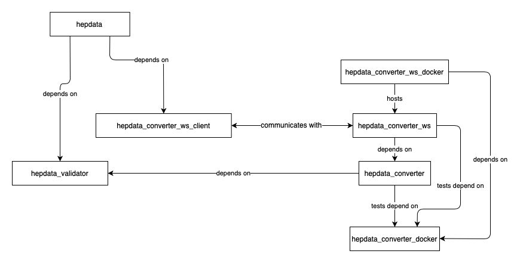

.. _development:

***********
Development
***********

.. contents:: Table of Contents
    :depth: 3
    :local:

Basic Information
=================

HEPData is based on the `Invenio Framework <https://invenio.readthedocs.io/en/latest/index.html>`_  which in turn is
built using `Flask <https://flask.palletsprojects.com/en/1.1.x/>`_.

HEPData requires:

 * `PostgreSQL <http://www.postgresql.org/>`_ (version 9.6) databases
 * `Redis <http://redis.io/>`_ for caching
 * `Celery <https://docs.celeryproject.org/en/stable/index.html>`_ for managing asynchronous tasks
 * `Elasticsearch <https://www.elastic.co/products/elasticsearch>`_ for indexing and searching data

Useful links:

 * :ref:`Modules <modules>` contains API documentation on the modules/packages within the Flask app.
 * :ref:`CLI <cli>` gives details of the HEPData command line tools.

Other HEPData Repositories
==========================

This web application with repository
`HEPData/hepdata <https://github.com/HEPData/hepdata>`_ depends on some
other packages that can be found under the `@HEPData
<https://github.com/HEPData>`_ organization on GitHub.  These additional
repositories are necessary for
`validation <https://github.com/HEPData/hepdata-validator>`_,
`conversion <https://github.com/HEPData/hepdata-converter>`_,
and to provide the converter as a
`web service <https://github.com/HEPData/hepdata-converter-ws>`_ with a
`client wrapper <https://github.com/HEPData/hepdata-converter-ws-client>`_.
Further repositories build Docker images with the `converter
dependencies <https://github.com/HEPData/hepdata-converter-docker>`_ and
run the `converter web service
<https://github.com/HEPData/hepdata-converter-ws-docker>`_.  See `here
<https://github.com/HEPData/hepdata/wiki/Deployment#hepdata-converter>`_
for more details on how to deploy the conversion software in production.
The relation between these different packages is summarised in the
following diagram:

JavaScript/Webpack
==================

Introduction
------------

The JavaScript and CSS are bundled using `Webpack <https://webpack.js.org>`_, via the following packages:

 * `pywebpack <https://pywebpack.readthedocs.io/en/latest/>`_ provides a way to define Webpack bundles in python.
 * `Flask-WebpackExt <https://flask-webpackext.readthedocs.io/en/latest/>`_ integrates `pywebpack` with Flask. It provides the `WebpackBundle` class used to define the entry points and contents of the Webpack packages, and the ``{{ webpack[...] }}`` template function used to inject javascript and css into a page.
 * `invenio-assets <https://invenio-assets.readthedocs.io/en/latest/>`_ integrates Flask-WebpackExt with Invenio and provides a CLI command to collect the assets.

Each module that requires javascript has a ``webpack.py`` file which list the JavaScript files and their dependencies. Dependencies need to be imported at the top of each JavaScript file.

Adding a new JavaScript file
----------------------------

 1. Create the file in ``<module>/assets/js``.
 2. Edit ``<module>/webpack.py`` and add an item to the ``entries`` dict, e.g.

 .. code-block:: python

    'hepdata-reviews-js': './js/hepdata_reviews.js',

 3. To include the file in another JavaScript file, use e.g.

 .. code-block:: javascript

    import HEPDATA from './hepdata_common.js' // Puts HEPDATA in the namespace
    import './hepdata_reviews.js' // Adds functions to HEPDATA from hepdata_reviews

 4. To include the file in an HTML page, use the ``webpack`` function with the name from ``'entries'`` in ``bundle.py``, with a ``.js`` extension. (Similarly, CSS files can be included using a ``.css`` extension.)

 .. code-block:: html

    {{ webpack['hepdata-reviews-js.js'] }}

If you need to add a new bundle, it will need to be added to the ``'invenio_assets.webpack'`` entry in ``setup.py`` (and you will need to re-run ``pip install -e.[all] hepdata``).

Building JavaScript/CSS assets
------------------------------
To build all of the JavaScript, run:

.. code-block:: console

   (hepdata)$ hepdata webpack build

If you have made a change to a ``webpack.py`` file, run:

.. code-block:: console

   (hepdata)$ hepdata webpack buildall

Occasionally the Webpack build will complete but there will be errors higher up in the output. If the JavaScript file
does not load in the page (e.g. you see a ``KeyError: not in manifest.json`` error), check the webpack build output.

When making changes to the javascript you may find it helpful to build the javascript on-the-fly, which also builds in
development mode (so the generated JavaScript files are unminified and in separate files):

.. code-block:: console

   (hepdata)$ cd $HOME/.virtualenvs/hepdata/var/hepdata-instance/assets
   (hepdata)$ npm start

npm dependency issues
---------------------

If you have issues with npm peer dependencies when running ``hepdata webpack buildall``, (e.g. an error message starting
``ERESOLVE unable to resolve dependency tree`` and followed by ``Could not result dependency: peer ...``) then you will
need to set the `legacy-peer-deps <https://docs.npmjs.com/cli/v7/using-npm/config#legacy-peer-deps>`_ flag for npm.
There are two ways to do this:

**Either:**

Set the flag globally in your npm config (NB: this will affect other npm projects):

.. code-block:: console

   (hepdata)$ npm config set legacy-peer-deps true

You will then be able to run ``hepdata webpack buildall``.

**Or:**

Run the webpack CLI ``install`` and ``build`` commands separately (rather than using ``buildall``) and pass ``--legacy-peer-deps`` to the npm install step:

.. code-block:: console

   (hepdata)$ hepdata webpack install --legacy-peer-deps
   (hepdata)$ hepdata webpack build
