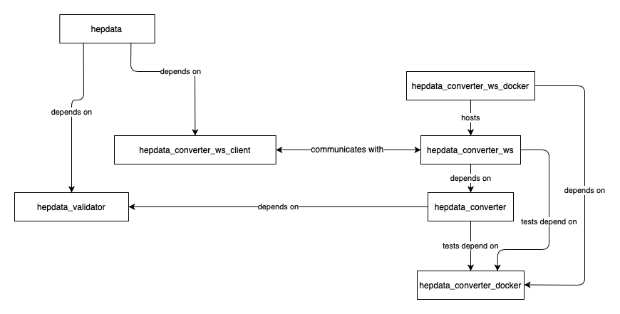

..
    This file is part of HEPData.
    Copyright (C) 2016 CERN.

    HEPData is free software; you can redistribute it
    and/or modify it under the terms of the GNU General Public License as
    published by the Free Software Foundation; either version 2 of the
    License, or (at your option) any later version.

    HEPData is distributed in the hope that it will be
    useful, but WITHOUT ANY WARRANTY; without even the implied warranty of
    MERCHANTABILITY or FITNESS FOR A PARTICULAR PURPOSE.  See the GNU
    General Public License for more details.

    You should have received a copy of the GNU General Public License
    along with HEPData; if not, write to the
    Free Software Foundation, Inc., 59 Temple Place, Suite 330, Boston,
    MA 02111-1307, USA.

    In applying this license, CERN does not
    waive the privileges and immunities granted to it by virtue of its status
    as an Intergovernmental Organization or submit itself to any jurisdiction.

.. include:: info.rst

The HEPData software was given a `Research Software Healthcheck
<https://software.ac.uk/programmes-and-events/research-software-healthcheck>`_
by the `Software Sustainability Institute <https://software.ac.uk>`_ in March 2020
(see :download:`evaluation report <Research_Software_Healthcheck_HEPData.pdf>`).

Installation
------------

This documentation explains how to install the web application locally for prospective HEPData developers.
It should not be required for normal HEPData users or data submitters.

.. toctree::
   :maxdepth: 1

   installation
   cli

API Reference
-------------

If you are looking for information on a specific function, class or method,
this part of the documentation is for you.  This documentation is mostly
generated automatically using the `Sphinx <http://www.sphinx-doc.org>`_
``automodule`` directive to extract docstrings from the Python modules.

.. toctree::
   :maxdepth: 2

   modules

.. toctree::
   :maxdepth: 1

   utils

Additional Notes
----------------

Notes on how to contribute, legal information and changes are here for the
interested.

.. toctree::
   :maxdepth: 1

   contributing
   changes
   license
   authors
   branding

Other HEPData Repositories
--------------------------

This web application with repository
`HEPData/hepdata <https://github.com/HEPData/hepdata>`_ depends on some
other packages that can be found under the `@HEPData
<https://github.com/HEPData>`_ organization on GitHub.  These additional
repositories are necessary for
`validation <https://github.com/HEPData/hepdata-validator>`_,
`conversion <https://github.com/HEPData/hepdata-converter>`_,
and to provide the converter as a
`web service <https://github.com/HEPData/hepdata-converter-ws>`_ with a
`client wrapper <https://github.com/HEPData/hepdata-converter-ws-client>`_.
Further repositories build Docker images with the `converter
dependencies <https://github.com/HEPData/hepdata-converter-docker>`_ and
run the `converter web service
<https://github.com/HEPData/hepdata-converter-ws-docker>`_.  See `here
<https://github.com/HEPData/hepdata/wiki/Deployment#hepdata-converter>`_
for more details on how to deploy the conversion software in production.
The relation between these different packages is summarised in the
following diagram:

